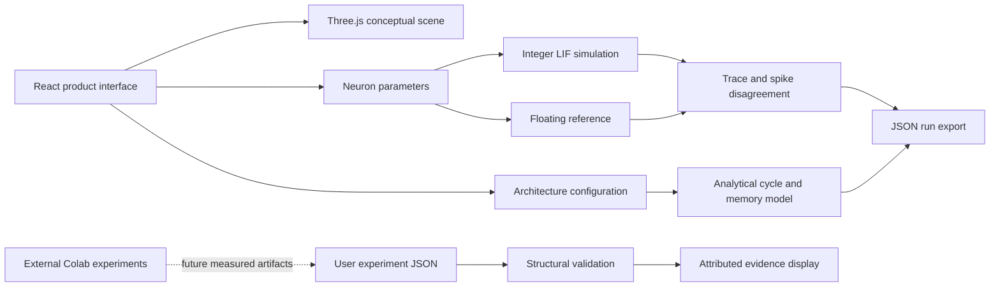

# NeuroNav: Research and Technical Guide

Version 0.1.0 | 23 September 2026 | Research demonstration application

Live application: https://neuronav-research-lab.vercel.app

Source repository (private, owner access required): https://github.com/RohitWakade07/neuronav-research-lab

## 1. What Has Been Built

NeuroNav is a browser-based research demonstrator for spiking-neuron arithmetic and FPGA-oriented architecture exploration. It contains an interactive Three.js chip scene, a deterministic LIF neuron laboratory, a real-time reactive-navigation scenario, a dense-network cycle/storage estimator, experiment-report import, simulation export, downloadable Colab templates, and primary-source references.

The chip is a conceptual rendering created procedurally in Three.js. Its animated particles illustrate spike pathways; they are not telemetry from the neuron laboratory or a fabricated physical device. The app contains no trained classifier, robot controller, event-camera integration, FPGA connection, or measured power results. All initial model-accuracy fields are pending. Imported reports are explicitly attributed to the user and are not independently verified by the application.

The original synopsis names reactive navigation but its initial implementation scope uses MNIST classification. This application implements the software demonstration portion of that scope. Calling it a completed navigation system or a validated hardware digital twin would exceed the evidence.

## 2. Evidence and Requirements

| Requirement                      | Implemented artifact                                                                  | Evidence boundary                                                    |
| -------------------------------- | ------------------------------------------------------------------------------------- | -------------------------------------------------------------------- |
| Interactive product presentation | Three.js chip, moving paths, orbit interaction, pause, responsive landing page        | Conceptual visualization only                                        |
| LIF dynamics                     | Integer and floating-reference traces, stimulus controls, exports                     | Executed browser arithmetic                                          |
| Reactive-navigation scenario     | Procedural road, obstacle modes, proximity events, neuron state and steering response | Conceptual deterministic model; no trained policy or vehicle physics |
| Fixed-point behavior             | Quantized decay, floor rounding, signed state saturation, immediate reset             | Single-neuron contract, not a quantized trained network              |
| FPGA architecture exploration    | 784-H-10 topology, lane/clock/precision controls                                      | Analytical estimates, not simulator cycle measurements               |
| Model training                   | Original Colab training template available to download                                | No executed training result supplied                                 |
| Experiment evidence              | JSON import with bounded structural validation                                        | User-reported values; provenance not authenticated                   |
| RTL equivalence                  | Planned test protocol below                                                           | Not yet executed                                                     |
| Navigation                       | Dataset and evaluation plan below                                                     | Future experiment                                                    |
| Deployment                       | Vite build, GitHub source, Vercel hosting                                             | Hosting is independent of scientific validation                      |

The browser app deliberately distinguishes computed values, analytical estimates, imported reports, and missing experiments. A SHA-256 string in a report identifies a claimed checkpoint; the browser does not possess that checkpoint to verify its hash.

## 3. Architecture



The delivered runtime is a static client application. Vercel serves the compiled assets; all numerical calculations occur in the browser. There is no database, server inference, payment integration, authentication system, or backend API. Uploaded JSON is read locally into React state and is discarded on reload. No report is uploaded to the server. External source links and Google Fonts cause their normal network requests.

### Source Map

| Path                      | Responsibility                                                                        |
| ------------------------- | ------------------------------------------------------------------------------------- |
| `src/main.jsx`            | Page composition, laboratory controls, evidence import and downloads                  |
| `src/Scene.jsx`           | Chip geometry, lighting, moving spike markers, pointer orbit and lifecycle cleanup    |
| `src/NavigationScene.jsx` | Road scene, vehicle, obstacle behavior, event visualization and synchronized steering |
| `src/engine.js`           | Pure LIF arithmetic, architecture estimator, evidence validation, export utility      |
| `src/style.css`           | Responsive layout, visual tokens, reduced-motion support                              |
| `tests/engine.test.js`    | Numeric boundary and estimator tests                                                  |
| `e2e/app.spec.js`         | Browser workflows, responsive checks, WebGL pixel checks and animation behavior       |
| `public/downloads/`       | Research guide, templates and original planning artifacts                             |
| `vite.config.js`          | React build and code splitting                                                        |
| `vercel.json`             | Vite deployment and SPA rewrites                                                      |

## 4. Neuron Contract

The app defines a discrete-time, current-driven neuron. One step is dimensionless; no biological timestep in milliseconds is assumed.

```text
raw[t] = floor(beta_q * state[t] / 256) + input[t]
pre[t] = clamp(raw[t], -32768, 32767)
spike[t] = 1 if pre[t] >= threshold else 0
state[t+1] = 0 if spike[t] == 1 else pre[t]
```

Default configuration: `beta_q = 243`, `threshold = 128`, constant current `38`, initial state zero, 100 steps. The first four pre-reset integer potentials are `38, 74, 108, 140`. The fourth step fires and resets immediately. A current exactly equal to the threshold fires. Negative multiplication is rounded toward negative infinity, matching arithmetic right shift when implemented with sufficient signed width.

The decay is an unsigned 8-bit numerator divided by 256. Its default numerical value is 0.94921875. Membrane state uses signed 16-bit saturation. This is an integer-state model; it should not be described as Q6.10 unless an explicit physical unit and fractional scaling are introduced.

The floating reference uses the same quantized decay coefficient and immediate reset but retains fractional membrane state without integer floor or saturation. Disagreement therefore measures this selected arithmetic approximation, not classification error or trained-model quantization loss. Negative and overflow boundary conditions are exercised in unit tests even though visible controls use nonnegative currents.

Stimuli:

- Constant: selected current every step.
- Burst: selected current for the first 8 steps of each 24-step period, otherwise zero.
- Pulse: four times the selected current on every twelfth step, otherwise zero.

The plot displays pre-reset potential, a threshold line and integer output spikes. Export includes both pre- and post-reset states, floating reference, saturation flags, full configuration and engine version `neuro-nav-lif-v1`.

## 5. Architecture Estimator

### Reactive-navigation scenario

The Navigation Twin explains a proposed sensing-to-action path in one synchronized 3D scene. Obstacle range is converted to a normalized proximity value over a 4-to-18 scene-unit interval. The encoder emits 0-to-32 synthetic events. Each event contributes eight integer current units to a LIF neuron with `beta_q = 224`, denominator 256 and threshold 150. On threshold, the neuron resets to zero. When proximity exceeds 0.35, a deterministic steering rule chooses the side opposite the obstacle and eases the vehicle toward a fixed lateral target.

The scene offers blocked-lane, crossing-obstacle and partially blocked-lane configurations. The displayed sensor distance, event count, pre-reset membrane value, spike count, decision and vehicle offset are derived from the same live simulation state. Sensor rays and moving particles visualize the encoding path. Pause stops the vehicle and neuron accumulation; reset recreates the scenario state.

Scene units are presented as metres for explanation but are not calibrated against a robotics simulator. Timing depends on browser animation frames, and the road contains no rigid-body, tire, braking, collision or actuator model. `AVOID` means the deterministic threshold rule is active. It is not a prediction from the unexecuted MNIST model, a learned navigation policy, a proof of collision avoidance or FPGA output. Its purpose is to show how event encoding, integer neuron integration and action selection would connect before a real navigation dataset and controller exist.

For hidden width H, 10 outputs, P parallel accumulation lanes and T timesteps:

```text
weights = 784*H + H*10
cycles_per_step = ceil(784*H/P) + H + ceil(H*10/P) + 10
cycles = T * cycles_per_step
latency_ms = cycles / (clock_MHz * 1000)
serial_inferences_per_second = clock_MHz * 1,000,000 / cycles
weight_KiB = weights * weight_bits / 8192
state_KiB = (H+10) * 16 / 8192
```

This schedule assumes each dense layer's weight processing is followed by one state-update cycle per neuron; layers and examples are serialized. There are no bias parameters. Weight precision affects storage only. P is an idealized lane count with sufficient memory bandwidth. Spike inputs gate weight contributions; a physical implementation might use additions instead of general-purpose multipliers.

Default analytic result: H=128, P=16, T=25, 50 MHz, 8-bit weights gives 101,632 weights, 6,490 cycles per step, 162,250 cycles per inference, 3.245 ms estimated latency, approximately 308.17 serial inferences/s, and 99.25 KiB weight storage. These numbers follow the formula; they are not observed FPGA results.

Excluded: BRAM port conflicts, memory stalls, pipeline fill and drain, input/output transfer, reset time, routing delay, controller overhead and physical implementation constraints. Generic bit storage cannot be relabeled as BRAM count, LUT count, DSP use, timing closure or power consumption. Event sparsity cannot be claimed to save cycles unless an event-driven scheduler and memory access mechanism are implemented and measured.

## 6. Corrections to the Earlier Research Templates

The original notebooks are distributed as unexecuted historical templates. The app uses a versioned contract; do not assume those notebooks are equivalent without revision.

1. The training template uses snnTorch LIF defaults. Official documentation specifies subtractive reset and delayed reset by default. The proposed integer neuron uses immediate reset to zero. Select an explicit common reset mechanism, threshold comparison, update order and beta in both implementations, retrain as needed, and compare deterministic traces. Setting reset options alone is insufficient until boundary semantics also match.
2. The earlier Python template uses 32-bit state without explicit signed-16-bit saturation, whereas the web lab saturates to 16 bits. Its emitted Verilog also uses 32-bit membrane state. Version and align widths, rounding, overflow, multiplication width and reset behavior before RTL comparison.
3. The earlier cycle formula counts weight operations but omits the state-update terms used in this app. Neither formula is a measured schedule. Record which formula was used when comparing reports.
4. Independent symmetric int8 weight export is not equivalent to Q1.7. Each layer needs a scale, and currents, thresholds and membrane units must be reconciled. A weight archive alone is not a working quantized model.
5. Seed initialization helps reproducibility but does not prove deterministic GPU execution or identical stochastic spike trains across model comparisons. Generate and retain paired encodings for float/integer evaluation.
6. Avoid choosing hyperparameters using the official test set. Establish a validation split before tuning. A notebook that reports the test set every epoch must not turn those reports into an undeclared selection criterion.
7. A notebook file passing JSON/nbformat validation is not evidence that its training, imports, downloaded data or generated RTL executed successfully.

These corrections supersede any earlier wording that treats notebook availability, quantized weight export or a proposed digital twin as completed research validation.

## 7. Dataset Decision and Collection Routes

MNIST is appropriate for the synopsis's initial image-classification benchmark. It has 60,000 training and 10,000 test examples. Use the training partition for fitting and a fixed validation subset; reserve the official test set for the selected final experiment. MNIST is static digit data, not navigation data or native event-camera output. Rate encoding turns pixel intensities into generated spike streams, not measurements from an event sensor.

N-MNIST is a supported event dataset in Tonic and can extend the event-data pipeline. It remains digit classification. Before use, review dataset terms, download availability, units, polarity, ordering, time binning and transforms. Record exact dataset version, checksums and preprocessing. Do not silently substitute synthetic events if downloads fail.

If MNIST is unavailable, retain the dataset loader error and retry an official or documented mirror with verified files. A locally generated toy dataset can test code paths but cannot inherit MNIST benchmark claims.

For navigation, collect a distinct dataset in a simulator with a proven physics/robotics engine such as Webots. Define observation modality, action space, robot geometry and controller frequency first. Log timestamped observations, commanded actions, collision events, route IDs and environment seeds. A conventional controller can provide imitation labels. Split by environment or route rather than adjacent frames to prevent leakage. Reserve unseen obstacle layouts, lighting conditions and dynamics for testing. Synthetic frame-difference events must be described as synthetic.

Compare a trained SNN policy against the labeling controller and a matched non-spiking baseline. Report success rate, collisions per distance, route completion time and control latency. Moving a robot model in a 3D webpage, by itself, provides none of this evidence.

## 8. Experimental Protocol

Before training, freeze the scientific question. A defensible initial question is: how do arithmetic precision and encoding duration affect classification accuracy, spike activity and the resources implied by a specified FPGA architecture? The application alone establishes no novelty.

Recommended experiment procedure:

1. Record dataset checksums, split IDs, package versions, hardware, seed and git commit.
2. Create a fixed training/validation split. Use validation only for model selection.
3. Train a floating SNN with an explicit update/reset contract and a comparable non-spiking baseline. Save configuration, checkpoint and training curves.
4. Evaluate at least three independent seeds if resources permit. Report each seed and summary statistics. Report the exact sample count.
5. Calibrate quantization ranges on training/validation data. Lock scales and thresholds before test evaluation.
6. Feed exactly the same encoded input spikes to floating and fixed-point models. Evaluate the full network, including both layers and readout.
7. Compute test accuracy, per-class recall, confusion matrix, spike count per layer, silent-output rate, saturation frequency and prediction disagreement. Define tie-breaking explicitly.
8. Report paired accuracy loss in percentage points. For confidence intervals, use an appropriate binomial interval for accuracy and a paired bootstrap for differences, preserving paired examples. Seed variability is a separate source of uncertainty.
9. Sweep precision and timestep counts under a fixed tuning budget. Record failed configurations, not only the best row.
10. Archive all raw outputs and provenance. Only then populate the evidence report.

The earlier 90% float accuracy and at most 3-5 percentage-point loss are proposed demonstration targets, not obtained results or universal scientific standards. The final paper should justify the thresholds and compare trade-offs rather than declaring success solely from a cutoff.

## 9. PC Simulation and Hardware Validation

At present the app is a functional digital model and analytical architecture estimator. A hardware-correlated digital twin would require a specified target, matching execution semantics, verification evidence and eventual correlation against device measurements.

The PC validation path has four distinct stages:

1. Functional reference: explicitly sized integer operations and deterministic golden vectors.
2. RTL simulation: synthesizable neuron, accumulator, state memory and controller; compare every accepted transaction to the reference.
3. Synthesis and implementation: choose an exact FPGA part, clock constraint and tool version. Report mapped utilization and achieved timing with report artifacts.
4. Physical correlation: once hardware is available, measure board behavior, I/O overhead and power under a documented workload. Compare measured behavior against the model.

For the first RTL module, use signed intermediates wide enough to retain the product, arithmetic shift, explicit saturation and defined threshold equality. Test zero input, equality at threshold, repeated spikes, negative inputs, beta endpoints, positive and negative saturation, reset during activity, long runs and seeded random vectors. Track reset cycles separately from accepted inference cycles. A waveform is useful but does not replace an automated full-trace comparison.

Use cocotb with a supported simulator, or a self-checking HDL testbench. Compare spikes and membrane state on every step. The current repository has no executed RTL equivalence report, synthesized resource report or board measurements. JavaScript unit tests cannot substitute for those artifacts.

## 10. Defining the 40% Milestone

Percentage completion is a project-management rubric, not a model performance metric. The following proposed allocation must be accepted by the research supervisor before being treated as an official percentage. Credit is awarded only after all evidence for a row exists.

| Work package                            | Project points | Acceptance evidence                                                    | Current state                        |
| --------------------------------------- | -------------: | ---------------------------------------------------------------------- | ------------------------------------ |
| Requirements and experiment protocol    |              5 | Approved traceability, claim boundaries and protocol                   | Draft documented; approval pending   |
| Reproducible training                   |             10 | Executed notebook, saved checkpoint, exact environment and data splits | Pending                              |
| Floating and integer network evaluation |             10 | Paired held-out metrics, calibrated scales and raw predictions         | Pending                              |
| RTL proof block                         |             10 | Passing golden-model comparison, simulator logs and vectors            | Pending                              |
| Display application                     |              5 | Working controls, exports, responsive view and deployment              | Implemented; verify with test report |
| Remaining research and hardware work    |             60 | Larger validation, comparison, synthesis, navigation scope and paper   | Future                               |

The web application can demonstrate the display package and neuron arithmetic now. It must not display an earned 40% score until the other acceptance evidence exists. This prevents a polished product view from being mistaken for completed experiments.

## 11. Evidence Format and Data Handling

`evidence-template.json` intentionally contains null accuracy fields and an invalid placeholder hash. It is not a sample result and cannot be imported successfully until populated with measurements.

Required fields are `schema = neuronav-evidence-v1`, nonempty `runId`, `dataset = MNIST`, `split = test`, integer `samples` from 1 to 10,000, `floatAccuracy` and `fixedAccuracy` as fractions in [0,1], and a 64-character hexadecimal `checkpointSha256`. The importer limits files to 100 KB and rejects malformed input with a visible message. A subset report does not qualify as a full-test benchmark.

The import is ephemeral, local and attributed. The app cannot validate that the experiment happened, that the split was respected, or that the checkpoint exists. Store the full checkpoint and raw logs in a research archive; a public presentation can publish their hashes and links as appropriate. Never put secret tokens or participant data into publicly hosted downloads.

Simulation export is a different schema, `neuronav-simulation-v1`. It contains the actual computed rows, configuration, assumptions, version and export timestamp. It does not fit the experiment-report importer because it contains no measured classifier accuracy. Retain the exact source revision alongside exported runs for long-term reproducibility.

## 12. Local Development, Build and Deployment

Use Node.js compatible with the committed Vite version; the application was built with Node 22.17.0 and npm 11.7.0. `package-lock.json` records the exact dependency tree. Use `npm ci` for reproducible installation.

```sh
npm ci
npm test
npm run dev
npx playwright install chromium
npx playwright test --workers=1
npm run build
```

The development server defaults to `http://127.0.0.1:5173`. If occupied, Vite chooses another port; set `TEST_BASE_URL` accordingly for browser tests. `npm run preview` serves the compiled production build. Browser tests expect the server to be started separately.

GitHub account: `RohitWakade07`. Repository intended for this application: `neuronav-research-lab`. Vercel project: `neuronav-research-lab`. Authenticate through official CLI/device login rather than placing credentials in source files.

```sh
gh auth status
vercel login
vercel --prod
```

Vercel uses the Vite build command and serves `dist`. The application needs no runtime environment variables. A linked Git repository can trigger future deployments; verify Git integration in the Vercel dashboard rather than assuming CLI deployment creates it automatically. Keep `.vercel`, `.env*`, `node_modules`, build output and local browser-test screenshots out of git.

The user requested a public product URL; source can remain private while the Vercel site is public. Publishing research artifacts in a public deployment should not be confused with peer-reviewed publication.

## 13. Validation and Presentation

Unit tests cover equality at threshold, zero input, a known positive trace, negative rounding, saturation, exact architecture calculations, lane/clock behavior and malformed evidence. Browser tests cover desktop/mobile/wide layouts, overflow, WebGL nonblank pixels, moving and paused frames, pointer orbit, reduced-motion behavior, parameter changes, JSON export, invalid/valid import, report clearing, downloads and mobile navigation.

Generated screenshots and numerical tests are engineering QA. They provide no accuracy or energy benchmark. See `VALIDATION_REPORT.md` for actual execution outcomes; this guide describes the checks rather than implying they all passed before execution.

Display sequence: open the product page; pause and rotate the conceptual chip; enter the lab; compare constant, burst and pulse traces; change decay and threshold; inspect actual output-spike disagreement; open the Navigation Twin and select each obstacle behavior; point out how distance changes event count, membrane state and the steering decision; explore lane/clock assumptions; export the run; open the evidence section and show pending experiments. Import only a measured experiment report. End by showing the acceptance gates and source documentation.

If WebGL is unavailable, the app presents a fallback message while the numerical lab remains usable. The page supports reduced motion and keyboard-accessible native controls. Google Fonts has system-font fallbacks; the app remains functional if that external font service is unavailable.

## 14. Publication and Extension Roadmap

The next research increment should align the neuron contract across training, Python and RTL, execute MNIST training, calibrate full-network quantization and produce paired metrics. Then implement and validate the RTL proof block. Add a real digit-inference view only when the tested model and preprocessing pipeline are available.

For stronger publication evidence, add a declared comparator table containing dataset, network topology, preprocessing, encoding, T, precision, FPGA part, clocks, tool versions, accuracy, latency definition, resources and power-measurement method. Mark incomparable fields explicitly. Neither tool documentation nor the app establishes superiority over published SNN accelerators. A systematic prior-art search and a specific technical contribution remain required.

Before expanding to navigation, select a realistic control task and data-generation protocol. Avoid training a navigation policy using digit labels. Before calling the model a digital twin of a physical board, correlate it with synthesis, timing and eventually measured hardware behavior.

## 15. Sources and Attribution

The starting requirements came from the user-supplied `SNN_FPGA_Synopsis_EDAI (1).pdf` and the previous `NeuroNav_Final_Architecture_Execution_Plan.md`. The original PDF is not republished by this app. The supplied notebooks and plan are available as historical working artifacts, with the corrections above.

- MNIST original benchmark: https://yann.lecun.org/exdb/mnist/
- Official Torchvision MNIST loader: https://docs.pytorch.org/vision/stable/generated/torchvision.datasets.MNIST.html
- snnTorch LIF parameters and reset defaults: https://snntorch.readthedocs.io/en/latest/snn.neurons_leaky.html
- snnTorch surrogate gradients: https://snntorch.readthedocs.io/en/latest/snntorch.surrogate.html
- Training Spiking Neural Networks Using Lessons From Deep Learning: https://arxiv.org/abs/2109.12894
- Tonic N-MNIST API: https://tonic.readthedocs.io/en/develop/autoapi/tonic/datasets/nmnist/
- cocotb verification framework: https://docs.cocotb.org/en/stable/
- Verilator guide: https://verilator.org/guide/latest/
- Yosys documentation: https://yosyshq.readthedocs.io/projects/yosys/en/latest/
- Three.js documentation: https://threejs.org/docs/
- Vite static deployment: https://vite.dev/guide/static-deploy
- Vercel Vite deployment: https://vercel.com/docs/frameworks/frontend/vite

These sources support benchmark/tool descriptions. Equations and schedules identified as this application's contract are design choices. No unexecuted result has been promoted to a measured research claim.

Retrieval note: the original MNIST URL above was inherited from the previous plan and timed out during this implementation's live check. The app links to the reachable official Torchvision MNIST documentation. Tonic, cocotb, Yosys, snnTorch and Vercel documentation were retrieved during this task. No dataset archive was downloaded or its checksum verified during web-app delivery.
